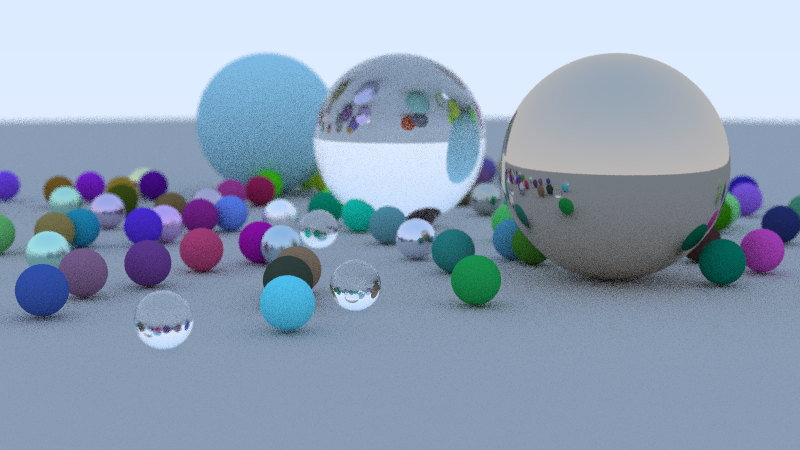

# Ray Tracing

A rudimentary ray tracer written from scratch in `C++`.

## Dependencies

The project was developed and tested on Linux. Windows support isn't tested. 

- `cmake` >= 3.16 (lower versions will probably work but it isn't tested)
- `make` (I used GNU Make 4.3, other will probably work)
- `clang++` >= 9.0.1 (C++17)

## Building

Clone the repository locally and go into the created directory:
```bash
> git clone https://github.com/smiga287/project_ray_tracer.git
> cd project_ray_tracer
```

Build by making a build directory (i.e. `build/`), run `cmake` in that directory, and then use `make` to build the project and try it out!
```bash
> mkdir build && cd build
> cmake .. 
> make
> ./project_ray_tracer output.ppm
```

## Example



## License
[MIT](https://choosealicense.com/licenses/mit/)
